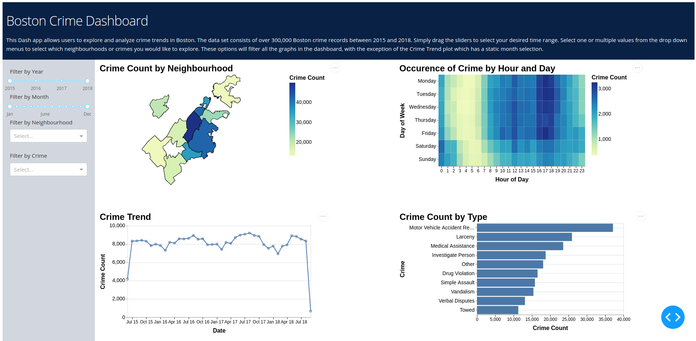

# Boston Crime App

*__Creators__: Mike Chen, Alexander Hinton, Andrea Lee, Yingping Qian*

https://gr202-dashboard-milestone2.herokuapp.com/
 
Boston Crime App is an interactive data visualization application that displays the crimes in Boston between 2015 and 2018 based on the data from the Boston Police Department.

The app contains a landing page that shows four plots. The first graph is a choropleth map showing the count of crime in each neighbourhood on a map of Boston. The second graph is a line graph outlining the trend of selected crime types over time. The third graph is a bar graph of the occurrences of different types of crime. The fourth graph is a heat map showing the occurrences of crime by the time of the day, and by day of the week.

All four graphs can be adjusted based on user input. From the dropdown lists, users can filter the variables of the graphs by district name (i.e. only show Downtown) and by crime type (i.e. only show Drug Violation). From the slide bars, users can choose either a specific month or year, and a range of months (i.e. show January to March) or years (i.e. only show data from the Year 2015). A different dropdown and slider menu will allow users to explore the crime incidents and get information about the specific district, time and crime type they are interested in. Users can view all the crime data graphs by scrolling down and right through the app interface.

## Preview

## Deployment 
[App hosted at Heroku!](https://gr202-dashboard-milestone2.herokuapp.com/) Please be patient, the app takes awhile to fully load up! 

## Contributing

We welcome any feedback and contributions to our Boston Crime App! 

If you have a feature request or find a bug, please create an issue in our repo. For details on creating an issue see GitHub documentation [here](https://help.github.com/en/github/managing-your-work-on-github/creating-an-issue).

If you would like to make any contribution to our app, you can fork this repo and send us a pull request(PR). For details on creating a PR see GitHub documentation [here](https://help.github.com/en/github/collaborating-with-issues-and-pull-requests/creating-a-pull-request). Your pull request will be reviewed by our team within 5 days.

Please note all contributors must abide by our [CODE OF CONDUCT](./CODE_OF_CONDUCT.md).

### References
[Creating choropleth maps in Altair](https://medium.com/dataexplorations/creating-choropleth-maps-in-altair-eeb7085779a1)
